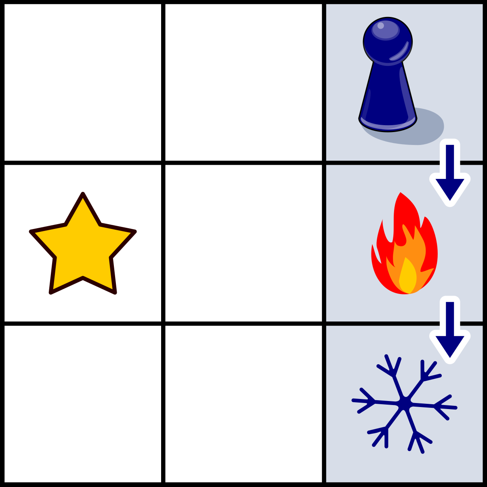
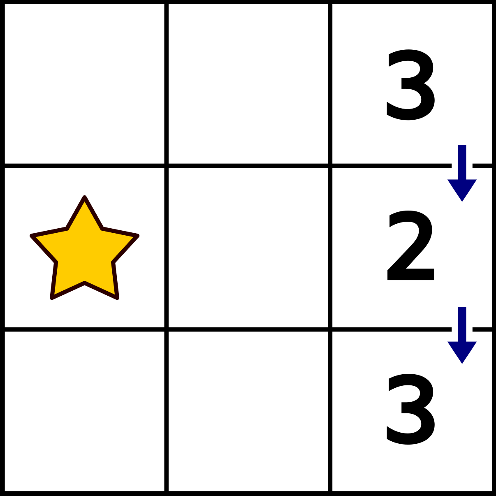
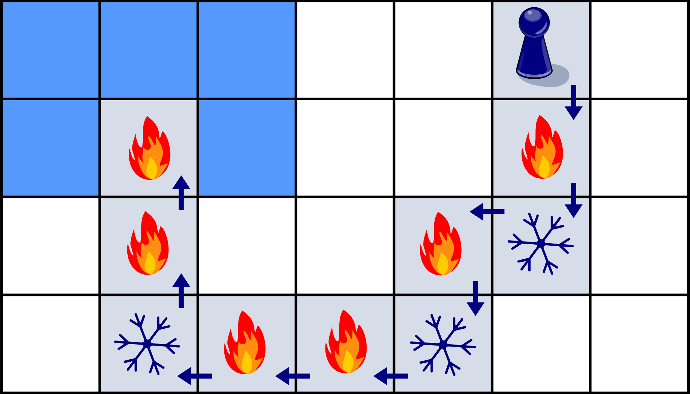
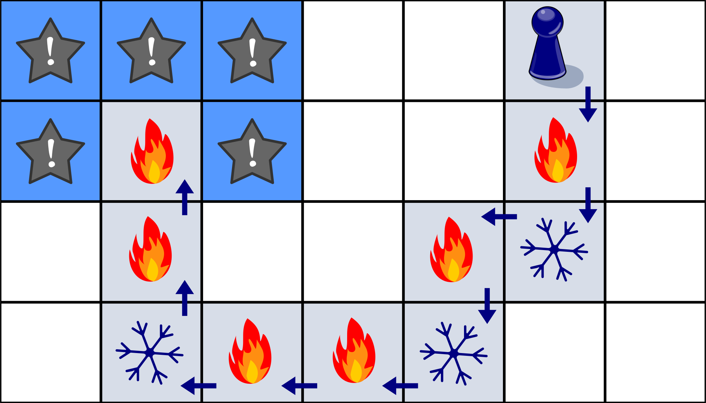
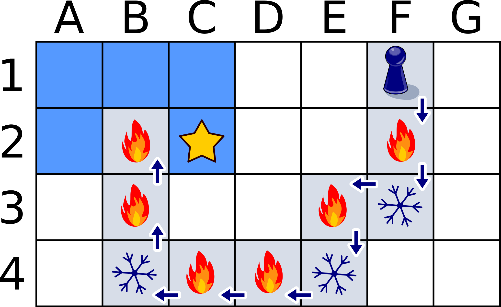

[star]: graphics/2023-SK-07_stern.svg "Stern (20px)"
[warmer]: graphics/2023-SK-07-warmer.svg "Wärmer (12px)"
[colder]: graphics/2023-SK-07-colder.svg "Kälter (20px)"
[gamepiece]: graphics/2023-SK-07-Daniel.svg "Spielfigur von Daniel (15px)"

## Body

Nina e Daniel giocano alla caccia al tesoro. Su una tavola con quadrati, Nina seleziona un quadrato e lo tiene a mente. Il tesoro è nascosto lì.

Daniel sceglie un campo di partenza. Da lì, sposta il suo pezzo da gioco ![gamepiece] di uno spazio alla volta: a sinistra, a destra, in alto o in basso.

-- | --+
 | Al primo tentativo, prendono un piccolo tabellone di gioco. Nina nasconde il tesoro nella casella con la stella ![star]. Daniel inizia in alto a destra e fa due passi lungo le frecce. Dopo ogni passo, Nina dice se Daniel è più vicino ![warmer] al tesoro o più lontano ![colder] dal tesoro rispetto a prima del passo.
 | L'immagine a destra mostra le distanze di Daniel dal tesoro. La distanza dal tesoro è il minor numero di passi che Daniel potrebbe attualmente compiere per raggiungere il tesoro.

Adesso prendono una tavola più grande.
Nina nasconde il tesoro in uno dei campi contrassegnati in blu.
L'immagine mostra nuovamente i passi di Daniel e ciò che Nina dice dopo ogni passo.

## Question/Challenge - for the brochures

Dove è nascosto il tesoro?

 
 

## Question/Challenge - for the online challenge

Dove è nascosto il tesoro?

 
 

## Interactivity instruction - for the online challenge

Fa clic sul quadrato corretto. Al termine, fa clic su "Salva risposta".

## Answer Options/Interactivity Description

click-to-select-one:  Man kann nur auf die fünf gelben Quadrate klicken. Es wird genau eines ausgewählt.

## Answer Explanation

La risposta corretta:

 
 
Seguiamo il percorso di Daniel e il riscontro di Nina. Daniel inizia nella riga 1 del tabellone. Dopo il primo passo si trova nella riga 2 e più vicino al tesoro rispetto alla riga 1. Dopo il passo successivo si trova nella riga 3 e di nuovo più lontano dal tesoro. Dato che è rimasto nella stessa colonna, il tesoro deve trovarsi su una casella della riga 2, infatti non importa in quale colonna sia nascosto il tesoro: la via più breve per raggiungere il tesoro da un'altra colonna è quella di trovarsi nella stessa riga.

Ma in quale colonna è nascosto il tesoro? Continuando il suo cammino, Daniel si avvicina inizialmente al tesoro della riga 4 facendo qualche passo verso sinistra; in particolare, è più vicino al tesoro della colonna 3 che a quello della colonna 4. Ma dopo l'ultimo passo della riga, Daniel si trova più lontano dal tesoro della colonna 2 che da quello della colonna 3. Quindi il tesoro deve trovarsi in un quadrato della colonna 3, siccome quanto detto sopra per le colonne vale anche per le righe: la via più breve per raggiungere il tesoro da un'altra riga è quella di trovarsi nella stessa colonna.

## This is Informatics

Daniel cammina (con il suo pezzo di gioco) attraverso il tabellone. Da ogni casella su cui si trova attualmente, Nina misura la distanza dalla casella con il tesoro e la utilizza per il suo feedback.  Di solito, la distanza tra due punti viene misurata come la lunghezza del collegamento rettilineo tra i punti (distanza euclidea).  Ma i due campi non sono, in senso stretto, dei punti. Pertanto, Nina misura la distanza tra due campi nel numero di passi che Daniel dovrebbe fare per il percorso più breve da un campo all'altro.  Questa _misura_ può essere generalmente applicata alle griglie ed è nota in informatica come _distanza di Manhattan_, derivata dalla pianta a griglia del quartiere newyorkese di Manhattan.

Gli informatici scelgono il modo di calcolare la distanza tra due oggetti a seconda del quesito che vogliono risolvere. Ad esempio, se si vuole misurare la distanza tra due parole della stessa lunghezza in un linguaggio naturale, si può contare il numero di punti in cui le parole differiscono; si tratta quindi della _distanza di Hamming_.  Se le parole sono di lunghezza diversa, si può usare la _distanza di Levenshtein_. Le distanze giocano spesso un ruolo nell'informatica quando si tratta di trovare soluzioni ottimali a un problema.  Non importa se la soluzione a un problema deve essere la più veloce, la più breve o la più economica:  spesso non è necessario cambiare l'algoritmo, ma solo la misura della distanza: durata, lunghezza o costo.

## This is Computational Thinking

Um diese Aufgabe zu bewältigen, überlegen wir uns zunächst eine verständliche und systematische Strategie. Mithilfe dieser Strategie können wir anschliessend die Navigation durch das Gitter vornehmen und die Hinweise für die Schatzsuche interpretieren. Systematik und Verständlichkeit sind wesentliche Zutaten guter Algorithmen und algorithmisch denkende Problemlöser. ((dieses finde ich zu allgemein und fast zu trivial)--> Es ist sehr allgemein - stimme zu. Wir füllen This is Computational Thinking nicht, in diesem Sinne würde ich es nicht entfernen)

Die Interpretation der Hinweise "N" und "W" helfen uns den Suchraum des Problems schrittweise zu verkleinen. Dieser Ansatz entspricht einer allgemeinen Methode, um Probleme zu lösen, die als _Teile und Herrsche_ bekannt ist. In unserem konkreten Fall signalisiert "W", dass wir uns im vorhergehenden Schritt vom Standort des Schatzes entfernt haben. Unter der verbleibenden potentiellen Standorten gibt es möglicherweise welche, die uns nun näher liegen als zuvor. Diese können als Standort des Schatzes ausgeschlossen werden. Die nun verbleibenden potentiellen Standorte werden mithilfe des nächsten Hinweises untersucht, bis am Ende ein Standort übrig bleibt, der dann unsere Lösung ist.

## Informatics Keywords and Websites

- Distanza di Manhattan: [https://it.wikipedia.org/wiki/Geometria_del_taxi](https://it.wikipedia.org/wiki/Geometria_del_taxi)
- Distanza di Hamming: [https://it.wikipedia.org/wiki/Distanza_di_Hamming](https://it.wikipedia.org/wiki/Distanza_di_Hamming)
- Distanza di Levenshtein: [https://it.wikipedia.org/wiki/Distanza_di_Levenshtein](https://it.wikipedia.org/wiki/Distanza_di_Levenshtein)

## Computational Thinking Keywords and Websites

 - Algorithmus

## Wording and Phrases
 - Ein __Schritt__ ist eine waagerechte oder ein senkrechte Bewegung von Daniel in ein direkt beachbartes Feld.
 - Die __Entfernung__ ist die Anzahl der Schritte, die Daniel ab dem derzeitigen Feld über waagerechte und senkrechte Schritte am schnellsten zum Schatz führen.
 - Nach jedem Schritt ist eine Person oder ein Subjekt __näher__ oder __weiter weg__ von einem Punkt oder einem Ziel als zuvor. Die Entfernung ist um einen Schritt kleiner oder grösser geworden.

## Comments

--
