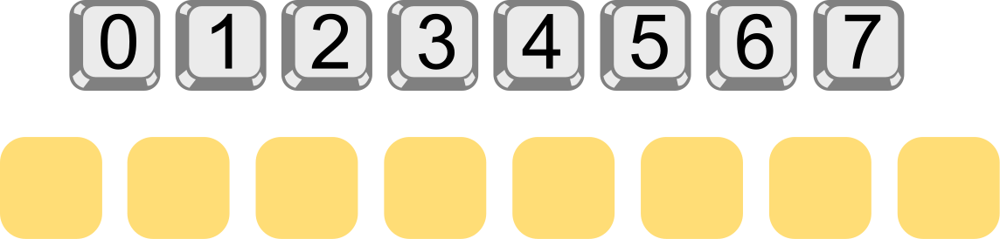
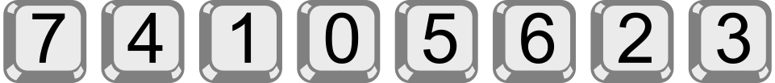

## Body

Bob hat ein Ziffernschloss an seiner Haustür.
Um es zu öffnen, muss man einen Zifferncode eingeben.
Alle Ziffern im Code müssen verschieden sein.
Aktuell hat der Code fünf Stellen und lautet so:

Bob hat sich den Code notiert, aber ein wenig verschleiert:
_n_ >> _c_  bedeutet, dass links von Ziffer _c_ im Code genau _n_ Ziffern stehen, 
die grösser sind als _c_.  Zum Beispiel notiert Bob mit

1 >> 3

dass links von Ziffer 3 genau eine Ziffer steht (nämlich die 4), die grösser ist als 3.
Den aktuellen Zifferncode hat er sich insgesamt so notiert:
 
0 >> 0 ; 3 >> 1 ; 0 >> 2 ; 1 >> 3 ; 0 >> 4

Ein Code aus nur fünf Ziffern ist Bob zu unsicher. 
Deshalb überlegt er sich einen neuen Code, aus den Ziffern 0 bis 7. 
Den neuen Code notiert er sich so:

3 >> 0 ; 2 >> 1 ; 4 >> 2 ; 4 >> 3 ; 1 >> 4 ; 1 >> 5 ; 1 >> 6 ; 0 >> 7

## Question/Challenge - for the brochures

Wie lautet der neue Code?

## Question/Challenge - for the online challenge

Wie lautet der neue Code?

## Interactivity instruction - for the online challenge

Ziehe die Ziffern an die richtigen Stellen. Wenn du fertig bist, klicke auf "Antwort speichern".
 

## Answer Options/Interactivity Description

Die "Tasten" sind draggables, die in die gelben container gezogen werden können.

## Answer Explanation

So ist es richtig:

Um den Code zu bestimmen, schauen wir uns Bobs Notation genauer an, nach und nach für die Ziffern 0 bis 7.

- 3 >> 0:  Links von 0 stehen genau 3 Ziffern, die grösser sind als 0.
Die Ziffer 0 muss also an der vierten Stelle des Codes stehen.
- 2 >> 1:  Links von 1 stehen genau 2 Ziffern, die grösser sind als 1.
Die Ziffer 1 muss also an der dritten Stelle des Codes stehen.
- 4 >> 2:  Links von 2 stehen genau 4 Ziffern, die grösser sind als 2.
Da die kleineren Ziffern 1 und 0 bereits an dritter und vierter Stelle stehen, 
müssen die 4 grösseren Ziffern an erster, zweiter, fünfter und sechster Stelle stehen.
Die Ziffer 2 muss also an der siebten Stelle des Codes stehen.
- 4 >> 3:  Links von 3 stehen genau 4 Ziffern, die grösser sind als 3.
Die Ziffer 3 muss also an der achten und letzten Stelle des Codes stehen.
- 1 >> 4:  Links von 4 steht genau 1 Ziffer, die grösser ist als 4.
Die Ziffer 4 muss also an der zweiten der verbleibenden Stellen stehen; das ist die zweite Stelle des Codes.
- 1 >> 5:  Links von 5 steht genau 1 Ziffer, die grösser ist als 5.
Die Ziffer 5 muss also an der zweiten der nun noch verbleibenden Stellen stehen; das ist die fünfte Stelle des Codes.
- 1 >> 6:  Links von 6 steht genau 1 Ziffer, die grösser ist als 6.
Die Ziffer 6 muss also an der zweiten der nun noch verbleibenden Stellen stehen; das ist die sechste Stelle des Codes.
- 0 >> 7:  Es gibt keine Ziffer, die grösser ist als 7.
Die Ziffer 7 muss an der letzten freien Stelle, also an der ersten Stelle des Codes stehen.

## This is Informatics

Bob beschreibt in seiner Notation, wie sich der Code zu einer sortierten Folge der verwendeten Ziffern bzw. Zahlen verhält. 

Schauen wir uns den fünfstelligen Code noch einmal an:  0 2 4 3 1. 
Er entsteht, indem man die sortierten Zahlen 0 1 2 3 4 nimmt und deren Positionen verändert.  Das Ergebnis nennt man auch _Permutation_ (der Zahlen 0 bis 4).
In einer Permutation können die Zahlen bzgl. ihrer Sortierung "verdreht" sein.
Zum Beispiel steht im Code die 4 vor der 3, während in der sortierten Folge die 3 vor der 4 steht (denn 3 < 4).
Also steht die 3 "falsch" bzgl. der Sortierung. Das bezeichnet man in der Kombinatorik, einem Teilgebiet der Mathematik, als _Inversion_ oder auch _Fehlstand_.

Bobs Code ist also eine Permutation, und seine Notation gibt für jede Zahl an, wie oft sie darin "invertiert" ist:
Die 0 steht richtig, die 1 ist Teil von 3 Inversionen (3 >> 1: drei grössere Zahlen stehen vor der 1), 
die 2 steht richtig, die 3 ist einmal invertiert, die 4 steht richtig.  
Die Folge dieser Inversionszahlen heisst _Inversionsssequenz_.
Die 0 steht richtig, die 1 ist Teil von 3 Inversionen (3 >> 1: drei größere Zahlen stehen vor der 1), 
die 2 steht richtig, die 3 ist einmal invertiert, die 4 steht richtig.
Die Folge dieser Inversionszahlen heißt _Inversionsssequenz_.
(Die Summe der Inversionszahlen beschreibt übrigens den Grad der Unsortiertheit einer Permutation; vergleiche dazu auch die Biberaufgabe "Zug entladen".)

Wir haben nun drei Folgen – den Code (bzw. die Permutation), die sortierte Folge und die Inversionssequenz – und fassen sie in dieser Tabelle zusammen:

:::indent
| ---------------------- | -- | -- | -- | -- | -- |
| **Code / Permutation** | 0  | 2  | 4  | 3  | 1  |
| **Sortierte Folge**    | 0  | 1  | 2  | 3  | 4  |
| **Inversionssequenz**  | 0  | 3  | 0  | 1  | 0  |
:::

Die Beschreibung der Lösung hat gezeigt, dass es einen effizienten Algorithmus gibt, der aus der Inversionssequenz die zugehörige Permutation berechnet. Es genügt, die Inversionssequenz einmal durchzugehen. Die Informatik beschäftigt sich häufig mit kombinatorischen Problemen und kennt viele Algorithmen zur Lösung solcher Probleme. Sie können bei der automatischen Lösung von Rätseln verwendet werden (wie etwa Sudokus), aber auch bei vielen "ernsthaften" Problemen. Meist sind sie deutlich komplizierter als der Algorithmus zur Lösung dieser Biberaufgabe.

## This is Computational Thinking

Optional - not to be filled 2023

## Informatics Keywords and Websites

 - Permutation: https://de.wikipedia.org/wiki/Permutation
 - Inversion bzw. Fehlstand: https://de.wikipedia.org/wiki/Fehlstand 

## Computational Thinking Keywords and Websites

 - Decomposition: https://en.wikipedia.org/wiki/Decomposition_(computer_science)

## Wording and Phrases

German wording and phrases please here!

 - _Word 1_: Bedeutung in dieser Aufgabe
 - _Phrase 1_: Bedeutung in dieser Aufgabe 

## Comments

Report changes on this file (older comments can be looked up in the original document)
_Zsuzsa Pluhár, 2023.07.20_: 
- "1 >> 4:" mit dem 5 ist es eindeutig.
- keywords muss zum TiI passen
- TiI: brute force/backtrack; logic (ähnlich zum Sudoku: https://en.wikipedia.org/wiki/Sudoku_solving_algorithms) oder cryptography 
_Name, Datum_: Kommentar 1

_Name, Datum_: Kommentar 2

