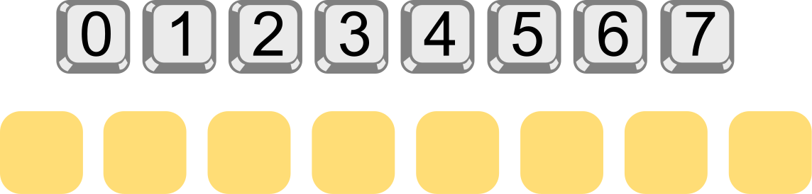

## Body

Bob a un cadenas sur la porte de sa maison. Pour l'ouvrir, il faut y entrer un code. Tous les chiffres du code doivent être différents. Actuellement, le code a cinq chiffres:

Bob a noté le code en le cachant un peu: _n_ >> _c_ veut dire qu'il y a exactement _n_ chiffres plus grands que _c_ à gauche du chiffre _c_ dans le code. Par exemple, en écrivant 

1 >> 3

Bob note qu'il y a exactement un chiffre plus grand que 3 à sa gauche, à savoir le 4. Il a noté le code actuel comme cela:
 
0 >> 0 ; 3 >> 1 ; 0 >> 2 ; 1 >> 3 ; 0 >> 4

Bob ne trouve pas qu'un code à cinq chiffres est assez sûr. Il choisit donc un nouveau code avec les chiffres de 0 à 7. Il note le noveau code comme ceci:

3 >> 0 ; 2 >> 1 ; 4 >> 2 ; 4 >> 3 ; 1 >> 4 ; 1 >> 5 ; 1 >> 6 ; 0 >> 7

## Question/Challenge - for the brochures

Quel est le nouveau code?

## Question/Challenge - for the online challenge

Quel est le nouveau code?

## Interactivity instruction - for the online challenge

Glisse les chiffres aux bonnes positions. Quand tu as fini, clique sur "Enregistrer la réponse".
 

## Answer Options/Interactivity Description

Die "Tasten" sind draggables, die in die gelben container gezogen werden können.

## Answer Explanation

Voici la bonne réponse:

Pour déterminer le code, nous analysons la notation de Bob pour les chiffres de 0 à 7 les uns après les autres.

- 3 >> 0:  Il y a exactement trois chiffres plus grands que 0 à gauche du 0. Le 0 doit donc se trouver à la quatrième position du code.
- 2 >> 1:  Il y a exactement deux chiffres plus grands que 1 à gauche du 1. Le chiffre 1 doit donc être à la troisième position du code.
- 4 >> 2:  Il y a exactement quatre chiffres plus grands que 2 à gauche du 2. Comme les petits chiffres 0 et 1 sont déjà aux positions trois et quatre, les chiffres plus grands doivent être en première, deuxième, cinquième et sixième positions. Le chiffre 2 doit donc être à la septième position du code.
- 4 >> 3:  Il y a exactement quatre chiffres plus grands que 3 à gauche du 3. Le chiffre 3 doit donc être à la huitième et dernière position du code.
- 1 >> 4:  Il y a exactement un chiffre plus grand que 4 à gauche du 4. Le chiffre 4 doit donc être à la deuxième des positions restantes; c'est la deuxième position du code.
- 1 >> 5:  Il y a exactement un chiffre plus grand que 5 à gauche du 5. Le chiffre 5 doit donc être à la deuxième des positions restantes; c'est la cinquième position du code.
- 1 >> 6:  Il y a exactement un chiffre plus grand que 6 à gauche du 6. Le chiffre 6 doit donc être à la deuxième des positions restantes; c'est la sixème position du code.
- 0 >> 7:  Il n'y a aucun chiffre plus grand que 7. Le chiffre 7 doit être à la dernière des positions libres, donc à la première position du code.

## This is Informatics

Dans sa notation, Bob décrit le code par rapport à une suite ordonnée des chiffres (ou nombres) utilisés.

Regardons à nouveau le code à cinq chiffres: 0 2 4 3 1. Il est généré en prenant les chiffres ordonnés 0 1 2 3 4 et en changeant leurs positions. On appelle le résutlat une _permutation_ (des chiffres de 0 à 4). Dans une permutation, l'ordre des chiffres est modifié. Par exemple, dans le code, le 4 précède le 3 alors que le 3 précède le 4 dans la suite ordonnée (car 3 < 4). Le 3 est donc à la "mauvaise position" par rapport à l'ordre de la suite. En combinatoire, un domaine des mathématiques, on appelle cela une _inversion_.

Le code de Bob est donc une permutation, et sa notation indique le nombre de fois que chaque chiffre est inversé: Le 0 est à la bonne position, le 1 participe à 3 inversions (3 >> 1: trois chiffres plus grands sont avant le 1), le 2 est à la bonne position, le 3 est inversé une fois, le 4 est à la bonne position. Cette suite de nombre d'inversions s'appelle une _séquence d'inversions_. La somme du nombre d'inversions décrit également le degré de désordre d'une permutation – voir l'exercice "Train de marchandises".

Nous avons à présent trois suites – le code (la permutation), le suite ordonnée et la séquence d'inversions – et les regroupons dans un tableau:

:::indent
| ------------------------- | -- | -- | -- | -- | -- |
| **Code / Permutation**    | 0  | 2  | 4  | 3  | 1  |
| **Suite ordonnée**        | 0  | 1  | 2  | 3  | 4  |
| **Séquence d'inversions** | 0  | 3  | 0  | 1  | 0  |
:::

La description de la solution a montré qu'il existe un algorithme efficace pour déterminer la permutation en partant de la séquence d'inversion. Il suffit de parcourir une fois la séquence d'inversions. L'informatique traite souvent de problèmes combinatoires et il y a beaucoup d'algorithmes pour résoudre de tels problèmes. Ils peuvent être utilisés pour la résolution automatique de casses-tête (comme les sudokus), mais aussi pour des problèmes "sérieux". En général, ils sont beaucoup plus compliqués que l'algorithme utilisé pour résoudre cet exercice du Castor.

## This is Computational Thinking

Optional - not to be filled 2023

## Informatics Keywords and Websites

 - Permutation: https://fr.wikipedia.org/wiki/Permutation
 - Combinatoire: https://fr.wikipedia.org/wiki/Combinatoire

## Computational Thinking Keywords and Websites

 - Decomposition: https://en.wikipedia.org/wiki/Decomposition_(computer_science)

## Wording and Phrases

German wording and phrases please here!

 - _Word 1_: Bedeutung in dieser Aufgabe
 - _Phrase 1_: Bedeutung in dieser Aufgabe 

## Comments

Report changes on this file (older comments can be looked up in the original document)
_Zsuzsa Pluhár, 2023.07.20_: 
- "1 >> 4:" mit dem 5 ist es eindeutig.
- keywords muss zum TiI passen
- TiI: brute force/backtrack; logic (ähnlich zum Sudoku: https://en.wikipedia.org/wiki/Sudoku_solving_algorithms) oder cryptography 
_Name, Datum_: Kommentar 1

_Name, Datum_: Kommentar 2

