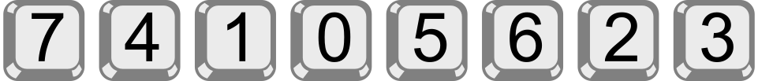

## Body

Bob ha una serratura a combinazione sulla porta di casa.
Per aprirla, è necessario inserire un codice numerico.
Tutte le cifre del codice devono essere diverse.
Attualmente, il codice è composto da cinque cifre e si legge così:

 
 
Bob si è scritto il codice, ma lo maschera un po':
_n_ >> _c_ significa che nel codice ci sono esattamente _n_ cifre a sinistra della cifra _c_
che sono maggiori di _c_.  Ad esempio, Bob annota che con

1 >> 3

a sinistra della cifra 3 c'è esattamente una cifra (cioè 4) che è maggiore di 3.
Ha scritto il codice numerico attuale in questo modo:

0 >> 0 ; 3 >> 1 ; 0 >> 2 ; 1 >> 3 ; 0 >> 4

Un codice di sole cinque cifre è troppo insicuro per Bob.
Pertanto, pensa a un nuovo codice, dalle cifre da 0 a 7.
Scrive il nuovo codice in questo modo:

3 >> 0 ; 2 >> 1 ; 4 >> 2 ; 4 >> 3 ; 1 >> 4 ; 1 >> 5 ; 1 >> 6 ; 0 >> 7

## Question/Challenge - for the brochures

Qual è il nuovo codice?

 
 
## Question/Challenge - for the online challenge

Qual è il nuovo codice?

 
 

## Interactivity instruction - for the online challenge

Trascina i numeri al posto giusto. Al termine, fa clic su "Salva risposta".

## Answer Options/Interactivity Description

Die "Tasten" sind draggables, die in die gelben container gezogen werden können.

## Answer Explanation

Ecco la risposta corretta:

 
 
Per determinare il codice, analizziamo più da vicino la notazione di Bob, una per una per le cifre da 0 a 7.

- 3 >> 0: ci sono esattamente 3 cifre a sinistra di 0 che sono maggiori di 0.
La cifra 0 deve quindi trovarsi nella quarta posizione del codice.
- 2 >> 1: ci sono esattamente 2 cifre a sinistra di 1 che sono superiori a 1.
La cifra 1 deve quindi trovarsi nella terza posizione del codice.
- 4 >> 2: ci sono esattamente 4 cifre a sinistra di 2 che sono maggiori di 2.
Poiché le cifre più piccole 1 e 0 sono già al terzo e quarto posto,
le 4 cifre più grandi devono essere al primo, secondo, quinto e sesto posto.
La cifra 2 deve quindi trovarsi nella settima posizione del codice.
- 4 >> 3: ci sono esattamente 4 cifre a sinistra di 3 che sono maggiori di 3.
La cifra 3 deve quindi trovarsi nell'ottava e ultima posizione del codice.
- 1 >> 4: a sinistra di 4 c'è esattamente 1 cifra maggiore di 4.
La cifra 4 deve quindi trovarsi nella seconda delle cifre rimanenti; si tratta della seconda cifra del codice.
- 1 >> 5: a sinistra di 5 c'è esattamente 1 cifra maggiore di 5.
La cifra 5 deve quindi trovarsi nella seconda delle cifre rimaste; si tratta della quinta cifra del codice.
- 1 >> 6: a sinistra di 6 c'è esattamente 1 cifra maggiore di 6.
La cifra 6 deve quindi trovarsi nella seconda delle cifre rimaste; si tratta della sesta cifra del codice.
- 0 >> 7: non esiste una cifra superiore a 7.
La cifra 7 deve trovarsi nell'ultima posizione libera, cioè nella prima posizione del codice.

## This is Informatics

Bob descrive nella sua notazione come il codice si riferisce a una sequenza ordinata di cifre o numeri utilizzati.

Vediamo di nuovo il codice a cinque cifre: 0 2 4 3 1.
Si crea prendendo i numeri ordinati 0 1 2 3 4 e cambiandone la posizione.  Il risultato è chiamato anche _permutazione_ (dei numeri da 0 a 4).
In una permutazione, i numeri possono essere "stravolti" per quanto riguarda il loro ordinamento.
Ad esempio, nel codice, 4 precede 3, mentre nella sequenza ordinata 3 precede 4 (perché 3 < 4).
Quindi il 3 è "sbagliato" rispetto all'ordinamento. In combinatoria, una branca della matematica, questo si chiama _inversione_ o _errore_.

Il codice di Bob è quindi una permutazione, e la sua notazione indica per ogni numero quante volte è "invertito" in esso:
Lo 0 è corretto, l'1 fa parte di 3 inversioni (3 >> 1: tre numeri più grandi sono davanti all'1),
il 2 è corretto, il 3 è invertito una volta, il 4 è corretto.
La sequenza di questi numeri di inversione è chiamata _sequenza di inversione_.
(A proposito, la somma dei numeri di inversione descrive il grado di non ordinabilità di una permutazione).

Ora abbiamo tre sequenze - il codice (o permutazione), la sequenza ordinata e la sequenza di inversione - e le riassumiamo in questa tabella:

:::indent
| -------------------------- | -- | -- | -- | -- | -- |
| **Codice / Permutazione**  | 0  | 2  | 4  | 3  | 1  |
| **Sequenza ordinata**      | 0  | 1  | 2  | 3  | 4  |
| **Sequenza di inversione** | 0  | 3  | 0  | 1  | 0  |
:::

La descrizione della soluzione ha dimostrato che esiste un algoritmo efficiente che calcola la permutazione corrispondente dalla sequenza di inversione. È sufficiente ripercorrere una volta la sequenza di inversione. L'informatica si occupa spesso di problemi combinatori e conosce molti algoritmi per risolverli. Possono essere utilizzati per la soluzione automatica di rompicapo (come i Sudoku), ma anche per molti problemi "seri". La maggior parte delle volte sono molto più complicati dell'algoritmo per la soluzione di questo compito del castoro.

## This is Computational Thinking

Optional - not to be filled 2023

## Informatics Keywords and Websites

- Permutazione: [https://it.wikipedia.org/wiki/Permutazione](https://it.wikipedia.org/wiki/Permutazione)

## Computational Thinking Keywords and Websites

 - Decomposition: https://en.wikipedia.org/wiki/Decomposition_(computer_science)

## Wording and Phrases

German wording and phrases please here!

 - _Word 1_: Bedeutung in dieser Aufgabe
 - _Phrase 1_: Bedeutung in dieser Aufgabe 

## Comments

Report changes on this file (older comments can be looked up in the original document)
_Zsuzsa Pluhár, 2023.07.20_: 
- "1 >> 4:" mit dem 5 ist es eindeutig.
- keywords muss zum TiI passen
- TiI: brute force/backtrack; logic (ähnlich zum Sudoku: https://en.wikipedia.org/wiki/Sudoku_solving_algorithms) oder cryptography 
_Name, Datum_: Kommentar 1

_Name, Datum_: Kommentar 2

